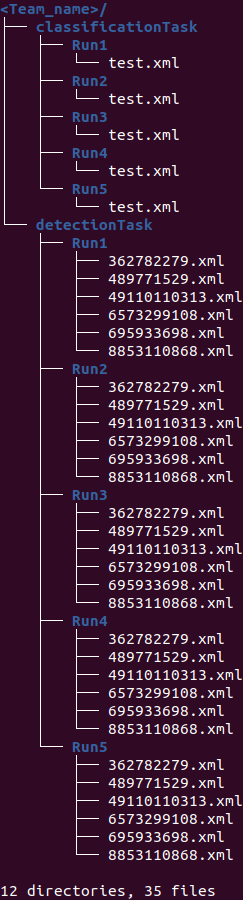

<!-- # please respect the structure below-->
*See the [MediaEval 2022 webpage](https://multimediaeval.github.io/editions/2022/) for information on how to register and participate.* <br>
*See the [Sport Task MediaEval 2022 webpage](https://multimediaeval.github.io/editions/2022/tasks/sportsvideo/) for information on the task.*

# Introduction

Running since 2019, this task was focused during the first two years on the classification of temporally segmented videos of single table tennis strokes.
Since the third edition of the task, two subtasks have been proposed. The dataset also has been enriched this year with new and more diverse stroke samples.

***Subtask 1 :*** is a classification task: participants are required to build a classification system that automatically labels video segments according to a performed stroke. There are 20 possible stroke classes and an additional non-stroke class.

***Subtask 2 :***  is a more challenging subtask proposed since last year: the goal here is to detect if a stroke has been performed, whatever its class, and to extract its temporal boundaries. The aim is to be able to distinguish between moments of interest in a game (players performing strokes) from irrelevant moments (picking up the ball, having a break…). This subtask can be a preliminary step for later recognizing a stroke that has been performed.
 

The organizers encourage the use of the method developed for subtask 1 to solve subtask 2. Participants are also invited to use the provided baseline as a starting point in their investigation. Finally, participants are encouraged to make their code public with their submission.

# Baseline
In order to help participants in their submission, to process videos, annotation files and deep learning techniques, we provide a baseline in this git which is formatted to process the provided data by the task organizers.

The method is simple and is based on the following method using only RGB data:

Pierre-Etienne Martin, Jenny Benois-Pineau, Renaud Péteri, Julien Morlier. 3D attention mechanism for fine-grained classification of table tennis strokes using a Twin Spatio-Temporal Convolutional Neural Networks. 25th International Conference on Pattern Recognition (ICPR2020), Jan 2021, Milano, Italy. [⟨hal-02977646⟩](https://hal.archives-ouvertes.fr/hal-02977646) - [Paper here](https://hal.archives-ouvertes.fr/hal-02977646/document)

The data processing is trivial. The rgb frames are resized to a width of 320 and stacked together to form tensors of length 96 following the annotation boundaries. Data augmentation is used in order to start at different time points, perform some spatial transformation and increase variability. The tensors are fed to a simple Network using attention mechanisms.

The training method uses nesterov momentum over a fixed amount of epoch. The learning rate is modified according to the loss evolution. The model with best performance on the validation loss is saved. Training method are similar for both subtasks.

We consider 21 classes for the classification task and 2 classes for the detection task. Negative samples are extracted for the detection task and negative proposals are build on its test set. Test is performed with the trimmed proposal (with one window centered or with a sliding window and several post processing approaches) or by running a sliding window on the whole video for the detection task. The lastest output is processed in order to segment in time strokes. Too short strokes are not considered. The model trained on the classification task is also used on the segmentation task without further training on the detection data.

This repository is not meant to lead to good performance but to provide a skeleton of a method to help the participants. The workflow is based on OpenCV and PyTorch. The requierment are provided in the [environment.yml file](environment.yml).

## Download the data
<!--
For organizers:
``` bash
# to create md5sums files
find -type f -exec md5sum "{}" + > MD5SUMS
```
-->
To have access to the data:
1. register to MediaEval workshop (free) with your **institutional** email address (gmail, gmx, outlook addresses... will not be accepted). See the [MediaEval website](https://multimediaeval.github.io/editions/2022/) to register.
2. send to the MediaEval organizers the [MediaEval data agreement](https://multimediaeval.github.io/editions/2022/docs/MediaEval2022_UsageAgreement.pdf) filled for our task (pages 1, 2, 3 and 8). Instructions are on the document.
3. by accessing the data, you agree to the [Particular Conditions](Particular_conditions2022.pdf) of usage of the data.
To formally accept them, send an email to  with: « I Accept the Usage Conditions » in the email body.

Once these 3 steps performed, you will receive an username and password to download the data.
Use the following commands to clone this repo and download the data (replace `USER` and `PASSWORD`).

``` bash
# Clone baseline repo
git clone https://github.com/ccp-eva/SportTaskME22.git
cd SportTaskME22
# Download data in repo
wget --user=USER --password='PASSWORD' -r -np -nH --cut-dirs=4 https://www.labri.fr/projet/AIV/MediaEval/2022/data/
# Check download is correct
cd data/
md5sum -c MD5SUMS
# Remove potential index files
find . -type f -name "index*" -exec rm {} \;
cd ..
```

It should create a directory "data/", with two subdirectories: "classificationTask" and "detectionTask". Another directory <Team_name> is provided meant to be filled for your submition.
In each task directory, you should have subdirectories dedicated to each set.
We advise not to modify these directories to be able to run properly the provided scripts.
Make sure to check that files were downloaded correctly using MD5SUM.
Make sure to delete the potential index files for running properly the check and evaluation scripts.

## Run the baseline
<!--
For organizers:
``` bash
# to create env .yml files
conda env export --name ME22_env --file environment_with_versions.yml
conda env export --name ME22_env --from-history --file environment.yml
```
-->

Please wisit [ANACONDA website](https://www.anaconda.com/) for its installation in order to replicate the running enviroment. 
Then install the required conda environment using the .yml files.
We also advise to use [screen](https://www.gnu.org/software/screen/manual/screen.html) to manage your terminals and be able to run long processes in the backgroud.

``` bash
# Create the conda environment (you can change the name and location)
conda env create --prefix ./env --file environment_with_versions.yml # or environment.yml
# Activate the conda environment
conda activate ./env
# Run the baseline (takes several hour, you may use screen)
python main.py
```

main.py shall be adapted according to your tree. We encourage participants to fork this repository and share their contributions. Best method (if easily reproducible) may be used as a baseline for next year.

You may having trouble working with gpu and pytorch even with the installation steps. This might be due to your platform. You can reinstall pytorch using the instruction on [the pytorch website](https://pytorch.org/). You may also check the [CUDA installation guideline](https://docs.nvidia.com/cuda/).

## Method

This implementation suggests two networks. Both networks are similar to the work "3D attention mechanisms in Twin Spatio-Temporal Convolutional Neural Networks. Application to  action classification in videos of table tennis games." by Pierre-Etienne Martin et al., ICPR 2021. They also follow similar training method: warm restart technique. The main divergence if the absence of Region Of Interest (ROI) which was computed from Optical Flow (OF) values.

The two networks are the following:
- V1, with succesive 4 conv+pool+attention layers and 2 conv+pool layers. All conv. layers use 3x3x3 filters. The first layers use 2x2x1 pooling filters (not pooling on the temporal doamin) and 2x2x2 pooling filters for the other layers.
- V2, with 5 succesive conv+pool+attention layers. Conv. filters are of size 7x5x3 and pooling filters of size 4x3x2 for the first two layers. The rest uses 3x3x3 and 2x2x2 for conv. and pooling filters repectively.

Each subtask has its own model. The size of the last layer is modified according to the number of class considered. Similar procedure was followed in "Spatio-Temporal CNN baseline method for the Sports Video Task of MediaEval 2021 benchmark" by Pierre-Etienne Martin. Several decision method are tested all subtasks: No Window, Vote, Mean, and Gaussian according to a temporal window.

In addition, the classification task model was tested to perform segmentation and its performance are reported in the next section. Two appraoches are considred: Negative class score VS all others for decision and Negative class score VS sum of all the others.

## Performance       

### Classification subtask

Performance of each model is presented according to each decision method in term on global classification accuracy in the folowwing table.

| Model | No Window	| Vote | Mean | Gaussian |
| :---: | :---: | :---: | :---: | :---: |
| V1 | .847 | .839 | .856 | .856 |
| V2 | .856 | .822 | .831 | **.864** |

### Detection subtask

The detection subtask is evaluated with regard to the Global IoU metric and the mAP (highest is the best).

#### With video candidates

Video candidates are purely succesive segments of frames without overlap and these blocks are classified.

##### IoU metric

| Model | No Window	| Vote | Mean | Gaussian |
| :---: | :---: | :---: | :---: | :---: |
| V1 | .358 | .360 | **.365** | .361 |
| V2 | .322 | .329 | .333 | .331 |

##### mAP metric

| Model | No Window	| Vote | Mean | Gaussian |
| :---: | :---: | :---: | :---: | :---: |
| V1 | .111 | .114 | .113 | .113 |
| V2 | .111 | **.118** | .117 | .117 |


#### With a sliding window

Here a sliding window with step one is used on the test videos. The outputs are combined in order to make decision following similar window methods. The models from subtask 1 are also tested (V1 Class. and V2 Class. wrt Neg VS all and Neg VS sum(all) for decision).

##### IoU metric

| Model	| Vote | Mean | Gaussian |
| :---: | :---: | :---: | :---: |
| V1 | **.515** | .341 | .33 |
| V1 Class. Neg VS all | .201 | .210 | .211 |
| V1 Class. Neg VS sum(all) | .203 | .203 | .205 |
| V2 | .308 | .473 | .466 |
| V2 Class. Neg VS all | .207 | .215 | .216 |
| V2 Class. Neg VS sum(all) | .209 | .211 | .212 |

##### mAP metric

| Model	| Vote | Mean | Gaussian |
| :---: | :---: | :---: | :---: |
| V1 | **.131** | .00201 | .00227 |
| V1 Class. Neg VS all | .00012 | .0.0017 | .00428 |
| V1 Class. Neg VS sum(all) | .000019 | .000054 | .00174 |
| V2 | .000731 | .102 | .1 |
| V2 Class. Neg VS all | .000506 | .00173 | .00237 |
| V2 Class. Neg VS sum(all) | .00145 | .00185 | .00261 |


# Submission

## Share you work with us

Please, insert your run in the <Team_name> folder (that you may rename with the name of your team) according to the task. The name of the runs may vary but you may use simple digits. Zip the folder and sent it to . You can submit up to five runs for each subtask. It is **not mandatory** to submit runs for both subtasks for participating.

Before sending your submission, check if the format you will send is correct by running from the data/ folder:

``` bash
python3 verif_submission.py <Team_name>
```

You may check similarly with the validation (or train) set by running:

``` bash
python3 verif_submission.py <Team_name> validation
```

You may check performances with validation (or train) set too by running:

``` bash
python3 evaluation.py <Team_name> validation
```

Similar scripts will be used to compare the test ground truth and your submission. Do not hesitate to give your feedback on the provided scripts.

The submission folder should look like:

`<Team_name>/<task>/<run_id>/<xml_file(s)_from_test_set>`

For example:



<!-- - `Team1`
	- `classificationTask`
	   - `1`
	     - `<xml_file_from_test_set>`
	   - `2`
	     - `<xml_file_from_test_set>`
	   - `3`
	     - `<xml_file_from_test_set>`
	   - `4`
	     - `<xml_file_from_test_set>`
	   - `5`
	     - `<xml_file_from_test_set>`
	- `detectionTask`
	   - `1`
	     - `<xml_file1_from_test_set>`
	     - `<xml_file2_from_test_set>`
	     - ...
	   - `2`
	     - `<xml_file1_from_test_set>`
	     - `<xml_file2_from_test_set>`
	     - ...
	   - `3`
	     - `<xml_file1_from_test_set>`
	     - `<xml_file2_from_test_set>`
	     - ...
	   - `4`
	     - `<xml_file1_from_test_set>`
	     - `<xml_file2_from_test_set>`
	     - ...
	   - `5`
	     - `<xml_file1_from_test_set>`
	     - `<xml_file2_from_test_set>`
	     - ... -->

Thank you for your participation.

## Working Note paper

After your submition, you will be asked to submit a Working Note paper to share your method, implementation and results. We strongly advice to make your implementation available on github and share its link. Please report the baseline results for comparison.

Guideline to write your paper is available [there](https://docs.google.com/document/d/12uSn0rRYxa3buiFNEbpa46dKsHOyqV2PHU_joRGMHRw/edit?usp=sharing). Latex template can de downloaded from [here](https://drive.google.com/file/d/1SMXWs-i4DKEUdblvzYaqvPuHLYHdBlQx/view?usp=sharing). Please update the shortitle command to fit out task with:
`\renewcommand{\shorttitle}{Sport Task}`

Please cite the overview paper describing the task and the baseline paper. See next section.

## To cite this work

To cite this work, we invite you to include some previous work. Find the bibTex below.

```
@inproceedings{mediaeval/Martin/2022/overview,
  author    = {Pierre{-}Etienne Martin and
               Jordan Calandre and
               Boris Mansencal and
               Jenny Benois{-}Pineau and
               Renaud P{\'{e}}teri and
               Laurent Mascarilla and
               Julien Morlier},
  title     = {Sport Task: Fine Grained Action Detection and Classification of Table Tennis Strokes from Videos for MediaEval 2022},
  booktitle = {MediaEval},
   series    = {{CEUR} Workshop Proceedings},
   publisher = {CEUR-WS.org},
  year      = {2022}
}

@inproceedings{mediaeval/Martin/2022/baseline,
  author    = {Pierre{-}Etienne Martin},
  title     = {Baseline Method for the Sport Task of MediaEval 2022 Benchmark with 3D CNN using Attention Mechanism},
  booktitle = {MediaEval},
   series    = {{CEUR} Workshop Proceedings},
   publisher = {CEUR-WS.org},
  year      = {2022}
}

@inproceedings{ICPR/Martin/2020,
  author    = {Pierre{-}Etienne Martin and
              Jenny Benois{-}Pineau and
              Renaud P{\'{e}}teri and
              Julien Morlier},
  title     = {3D attention mechanisms in Twin Spatio-Temporal Convolutional Neural Networks. Application to  action classification in videos of table tennis games.},
  booktitle = {{ICPR}},
  publisher = {{IEEE} Computer Society},
  year      = {2021},
}

@phdthesis{thesis/Martin/2020,
  author    = {Pierre{-}Etienne Martin},
  title     = {Fine-Grained Action Detection and Classification from Videos with
               Spatio-Temporal Convolutional Neural Networks. Application to Table
               Tennis. (D{\'{e}}tection et classification fines d'actions {\`{a}}
               partir de vid{\'{e}}os par r{\'{e}}seaux de neurones {\`{a}}
               convolutions spatio-temporelles. Application au tennis de table)},
  school    = {University of La Rochelle, France},
  year      = {2020},
  url       = {https://tel.archives-ouvertes.fr/tel-03128769},
  timestamp = {Thu, 25 Feb 2021 08:50:23 +0100},
  biburl    = {https://dblp.org/rec/phd/hal/Martin20a.bib},
  bibsource = {dblp computer science bibliography, https://dblp.org}
}VERSION = {v1},
}
```

